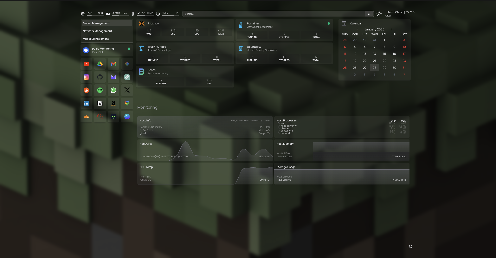
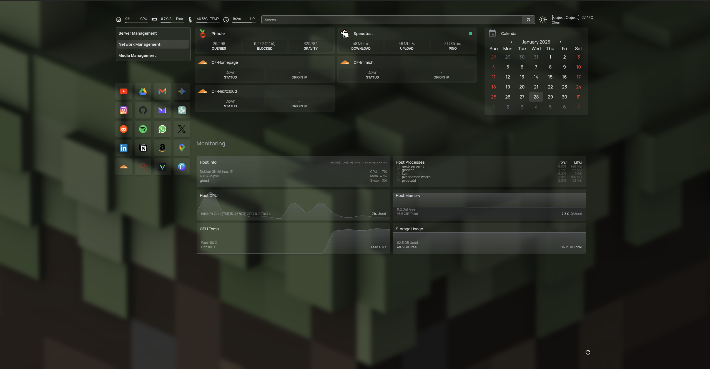
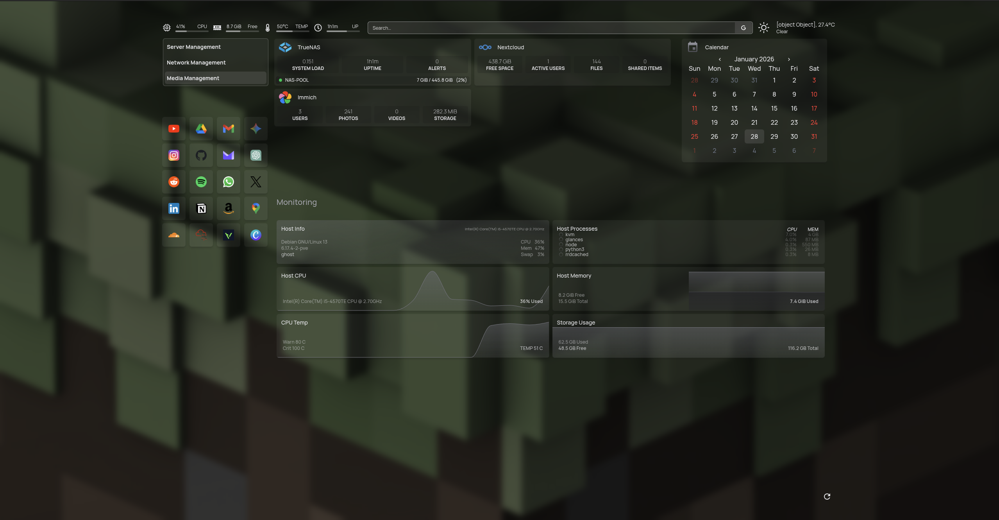

# Custom Homepage Dashboard

A sleek and modern self-hosted dashboard built with [Homepage](https://gethomepage.dev/) for managing homelab infrastructure, network services, and media storage with real-time monitoring capabilities.

## 📸 Screenshots

### Server Management Tab

*Infrastructure monitoring with Proxmox, Portainer environments, and Beszel system monitoring*

### Network Management Tab

*Network services including Pi-hole DNS, Speedtest tracker, and Cloudflare tunnel monitoring*

### Media Management Tab

*Media & storage services with TrueNAS, Nextcloud, and Immich photo management*

---

## ✨ Features

### 🎯 Core Capabilities
- **Custom Tabbed Layout** - Organized sidebar navigation with three main tabs
- **Real-Time Monitoring** - Live status tracking for all infrastructure services
- **Quick Access Bookmarks** - 20+ favorite sites with icon-only sidebar
- **Integrated Calendar** - Monthly calendar widget with timezone support
- **System Metrics** - CPU, memory, temperature, and uptime tracking via Glances
- **Weather Integration** - Local weather information powered by OpenMeteo
- **Dark Theme** - Modern zinc-colored dark theme with custom background

### 🔧 Service Integrations
- **Proxmox VE** - Hypervisor management with resource monitoring
- **Portainer** - Multi-environment Docker container orchestration
- **TrueNAS Scale** - Storage pool management and monitoring
- **Pi-hole** - DNS statistics and ad-blocking metrics
- **Beszel** - Advanced system monitoring (v2)
- **Cloudflare** - Tunnel status monitoring for secure remote access
- **Nextcloud** - Personal cloud storage statistics
- **Immich** - Photo library management (v2)

---

## 🎨 Layout Overview

### Left Sidebar Navigation

#### Navigation Tabs
- **Server Management** - Infrastructure and container services
- **Network Management** - Network tools and connectivity
- **Media Management** - Storage and media applications

#### Quick Launch Icons (25+ Sites)
Organized favorites including:
- **Productivity**: Gmail, Drive, Calendar, Notion
- **Social**: Instagram, Reddit, WhatsApp, X, LinkedIn
- **Development**: GitHub, ChatGPT, Gemini
- **Entertainment**: YouTube, Spotify, Amazon
- **Tools**: Cloudflare, TruyHackMe, Hackviser, Canva

### Main Content Area

#### Infrastructure Services (Server Tab)
- **Proxmox** - Node status, resource utilization, VM/LXC controls
- **Portainer** - Three environments monitored:
  - LXC Container environment
  - TrueNAS Apps environment
  - Ubuntu PC environment
- **Beszel** - Comprehensive system monitoring dashboard

#### Network Services (Network Tab)
- **Pi-hole** - DNS queries, ads blocked, percentage blocked
- **Speedtest Tracker** - Download/upload speeds, ping, recent tests
- **Cloudflare Tunnels** - Status monitoring for:
  - Homepage tunnel
  - Immich tunnel
  - Nextcloud tunnel

#### Media & Storage (Media Tab)
- **TrueNAS** - Pool health, usage statistics, dataset information
- **Nextcloud** - User count, file count, storage usage
- **Immich** - Photo count, video count, storage usage

#### Pulse Monitoring Sidebar
- Real-time site monitor status
- Uptime tracking for critical services

### Bottom Section - System Monitoring
Two-row grid layout displaying:
- **Host Info** - System information and uptime
- **Host Processes** - Running process count and details
- **Host CPU** - CPU usage percentage and load
- **Host Memory** - RAM usage and availability
- **CPU Temperature** - Package temperature monitoring
- **Storage Usage** - Filesystem usage statistics

### Right Panel
- **Monthly Calendar** - Full calendar view with:
  - Week starting Sunday
  - Time display enabled
  - Asia/Kolkata timezone

---

## 📦 Installation

### Prerequisites

- Docker & Docker Compose installed
- Access to your homelab services (Proxmox, TrueNAS, etc.)
- API keys/tokens for integrated services
- Glances running on Proxmox host (port 61208)

### Quick Start

1. **Clone this repository**
   ```bash
   git clone <your-repo-url>
   cd homepage-config
   ```

2. **Create environment file**
   ```bash
   cp .env.example .env
   ```

3. **Configure environment variables**
   Edit `.env` with your service details (see [Environment Variables](#-environment-variables) section)

4. **Update configuration paths**
   Edit `docker.yaml` to match your system:
   ```yaml
   volumes:
     - ./config:/app/config
     - ./public/images:/app/public/images
     - /var/run/docker.sock:/var/run/docker.sock:ro
   ```

5. **Deploy with Docker**
   ```bash
   docker-compose up -d
   ```

6. **Access your dashboard**
   Navigate to `http://localhost:3000` or your configured domain

---

## 📁 File Structure

```
homepage-config/
├── config/
│   ├── bookmarks.yaml      # Quick access favorite sites
│   ├── custom.css          # Custom styling and layout
│   ├── docker.yaml         # Docker socket configuration
│   ├── proxmox.yaml        # Proxmox API connection
│   ├── services.yaml       # Service widgets and integrations
│   ├── settings.yaml       # Main dashboard settings
│   └── widgets.yaml        # Top bar widgets (search, resources, weather)
├── public/
│   └── images/             # Custom service icons
├── screenshots/            # Dashboard screenshots
├── docker-compose.yml      # Docker deployment configuration
├── .env                    # Environment variables (create from .env.example)
├── .env.example            # Template for environment variables
└── README.md              # This file
```

---

## 🔧 Configuration Guide

### Adding New Services

Edit `services.yaml` and add your service under the appropriate category:

```yaml
- Infrastructure:
    - Your Service:
        icon: service-icon.png
        href: http://service-url:port
        description: Service description
        widget:
          type: service-type
          url: http://service-url:port
          # Additional widget-specific parameters
```

### Customizing Background

Edit `settings.yaml`:
```yaml
background:
  image: https://your-image-url.jpg
  blur: sm              # sm, md, lg, xl
  saturate: 50          # 0-100
  brightness: 50        # 0-100
  opacity: 80           # 0-100
```

### Modifying Layout

The `custom.css` file controls three main layout sections:

1. **Tab Navigation** (`#myTab`)
   - Fixed position at top left
   - Width: 270px

2. **Sidebar Sections** (`.bookmark-group`, `[id="sidebar"]`)
   - Positioned absolutely on left
   - Bookmarks at top: -287px
   - Pulse monitoring below

3. **Main Content Grid** (`#layout-groups`)
   - Flexible row-wrap layout
   - Responsive columns
   - Service blocks: min 400px width
   - Calendar column: fixed 380px

4. **Monitoring Section**
   - Full-width bottom section
   - 2-column grid for widgets
   - Centered with margin-top

### Adding Bookmarks

Edit `bookmarks.yaml`:
```yaml
- FavSites:
    - Site Name:
        - icon: icon-name  # or custom URL
          href: https://site-url.com
```

Supported icon formats:
- Built-in icons: `youtube`, `github`, `gmail`, etc.
- Custom URLs: `https://external-content.duckduckgo.com/ip3/example.com.ico`
- Local files: Place in `public/images/` and reference as `icon.png`

### Widget Configuration

**Top Bar Widgets** (`widgets.yaml`):

1. **Search Bar**
   ```yaml
   - search:
       provider: google
       focus: true
       target: _blank
   ```

2. **System Resources**
   ```yaml
   - resources:
       cpu: true
       memory: true
       cputemp: true
       tempmin: 0
       tempmax: 100
       uptime: true
       units: metric
       refresh: 3000  # milliseconds
   ```

3. **Weather Widget**
   ```yaml
   - openmeteo:
       label: City Name
       latitude: 13.3409
       longitude: 74.7421
       timezone: Asia/Kolkata
       units: metric
       cache: 30  # minutes
   ```

---

## 🔐 Security Best Practices

### API Keys & Tokens
- ✅ Store all sensitive data in `.env` file
- ✅ Add `.env` to `.gitignore`
- ✅ Never commit API keys to version control
- ✅ Use token-based authentication where available
- ✅ Rotate tokens regularly

### Network Security
- ✅ Use Cloudflare Tunnels for external access
- ✅ Enable HTTPS with valid certificates
- ✅ Restrict Portainer/Proxmox to trusted networks
- ✅ Configure firewall rules appropriately
- ✅ Use VPN for remote access when possible

### Container Security
- ✅ Run containers as non-root user when possible
- ✅ Mount Docker socket as read-only (`:ro`)
- ✅ Keep Homepage and all services updated
- ✅ Use Docker secrets for sensitive data in production
- ✅ Implement proper network segmentation

### Access Control
- ✅ Enable authentication on Homepage (via reverse proxy)
- ✅ Use strong passwords for all services
- ✅ Implement 2FA where supported
- ✅ Regularly audit access logs
- ✅ Use separate service accounts with minimal permissions

---

## 📊 Monitoring Setup

### Glances Configuration

Homepage uses Glances for system monitoring. Ensure Glances is running on your Proxmox host:

```bash
# Install Glances
sudo apt update
sudo apt install glances

# Run Glances in web server mode
glances -w --disable-plugin docker

# Or with systemd service
sudo systemctl enable glances
sudo systemctl start glances
```

**Glances Widgets** configured in `services.yaml`:
- Host Info (system details)
- Host Processes (process count)
- Host CPU (usage percentage)
- Host Memory (RAM usage)
- CPU Temperature (sensor monitoring)
- Storage Usage (filesystem metrics)

### Pulse Site Monitoring

The sidebar includes a Pulse widget that monitors service availability:
```yaml
siteMonitor: http://{{HOMEPAGE_VAR_LXC_IP}}:7655
```

---

## 🐛 Troubleshooting

### Widgets Not Loading

**Symptoms**: Widgets show "Error" or blank data

**Solutions**:
1. Verify API keys in `.env` file are correct
2. Check service URLs are accessible from Homepage container:
   ```bash
   docker exec homepage ping service-ip
   ```
3. Review docker logs:
   ```bash
   docker logs homepage
   docker logs homepage --tail 100 -f
   ```
4. Test API endpoints manually:
   ```bash
   curl -k https://proxmox-ip:8006/api2/json/nodes
   ```
5. Verify `allowInsecure: true` for self-signed certificates

### Layout Issues

**Symptoms**: Services overlapping or sidebar misaligned

**Solutions**:
1. Clear browser cache (Ctrl+Shift+Delete)
2. Hard refresh (Ctrl+Shift+R)
3. Verify `custom.css` is properly mounted:
   ```bash
   docker exec homepage ls -la /app/config/
   ```
4. Check for CSS conflicts in browser DevTools
5. Validate YAML syntax in configuration files

### Container Not Starting

**Symptoms**: Container exits immediately or won't start

**Solutions**:
1. Check Docker socket permissions:
   ```bash
   ls -l /var/run/docker.sock
   sudo chmod 666 /var/run/docker.sock  # temporary
   ```
2. Verify volume paths exist and are accessible
3. Check docker-compose.yml syntax:
   ```bash
   docker-compose config
   ```
4. Review container logs:
   ```bash
   docker-compose logs homepage
   ```
5. Ensure port 3000 is not in use:
   ```bash
   netstat -tulpn | grep 3000
   ```

### Environment Variables Not Working

**Symptoms**: Services show {{HOMEPAGE_VAR_*}} instead of values

**Solutions**:
1. Verify `.env` file is in the same directory as `docker-compose.yml`
2. Check `env_file` is specified in `docker-compose.yml`:
   ```yaml
   env_file:
     - .env
   ```
3. Restart container after updating `.env`:
   ```bash
   docker-compose down
   docker-compose up -d
   ```
4. Verify variable names match exactly (case-sensitive)

### Proxmox Widget Issues

**Symptoms**: Proxmox widget shows authentication errors

**Solutions**:
1. Create API token in Proxmox:
   - Datacenter → Permissions → API Tokens
   - Create token with appropriate privileges
2. Verify token format: `user@pam!token-name`
3. Check token secret is correct
4. Ensure `allowInsecure: true` for self-signed certs
5. Test token manually:
   ```bash
   curl -k -H "Authorization: PVEAPIToken=USER@pam!TOKEN=SECRET" \
     https://proxmox-ip:8006/api2/json/nodes
   ```

---

## 📝 Environment Variables

### Required Variables

| Variable | Description | Example | Notes |
|----------|-------------|---------|-------|
| `HOMEPAGE_VAR_PROXMOX_IP` | Proxmox server IP address | `192.168.1.100` | Include port if non-standard |
| `HOMEPAGE_VAR_PROXMOX_TOKEN_ID` | Proxmox API token ID | `root@pam!homepage` | Format: user@realm!token-name |
| `HOMEPAGE_VAR_PROXMOX_TOKEN_SECRET` | Proxmox API token secret | `xxxxxxxx-xxxx-xxxx-xxxx-xxxxxxxxxxxx` | UUID format |
| `HOMEPAGE_VAR_LXC_IP` | LXC container IP | `192.168.1.101` | For Portainer/Beszel/Speedtest |

### Service-Specific Variables

#### Portainer
| Variable | Description | Example |
|----------|-------------|---------|
| `HOMEPAGE_VAR_PORTAINER_KEY` | Portainer API key | `ptr_xxxxxxxxxxxxxxxxxxxx` | Create in Portainer → Settings → API |

#### Storage & Media
| Variable | Description | Example |
|----------|-------------|---------|
| `HOMEPAGE_VAR_TRUENAS_IP` | TrueNAS server IP | `192.168.1.103` |
| `HOMEPAGE_VAR_TRUENAS_KEY` | TrueNAS API key | `1-xxxxxxxxxxxxxxxxxxxxxx` | Create in TrueNAS → API Keys |
| `HOMEPAGE_VAR_NEXTCLOUD_USER` | Nextcloud username | `admin` |
| `HOMEPAGE_VAR_NEXTCLOUD_PASS` | Nextcloud password | `password123` | Use app password |
| `HOMEPAGE_VAR_IMMICH_KEY` | Immich API key | `xxxxxxxxxxxxxxxxxxxxxxxx` | Create in Immich → Account Settings |

#### Network Services
| Variable | Description | Example |
|----------|-------------|---------|
| `HOMEPAGE_VAR_PIHOLE_IP` | Pi-hole server IP | `192.168.1.102` |
| `HOMEPAGE_VAR_PIHOLE_TOKEN` | Pi-hole API token | `xxxxxxxxxxxxxxxxxxxxxxxx` | Found in Pi-hole → Settings → API |
| `HOMEPAGE_VAR_SPEEDTEST_KEY` | Speedtest Tracker key | `xxxxxxxxxxxxxxxxxxxxxxxx` | Create in Speedtest → Settings → API |

#### Cloudflare
| Variable | Description | Example |
|----------|-------------|---------|
| `HOMEPAGE_VAR_CLOUDFLARE_ACCOUNT_ID` | Cloudflare account ID | `xxxxxxxxxxxxxxxxxxxxxxxx` | Found in Cloudflare dashboard URL |
| `HOMEPAGE_VAR_CLOUDFLARE_KEY` | Cloudflare API token | `xxxxxxxxxxxxxxxxxxxxxxxx` | Create with Zone:Read, Account:Read |
| `HOMEPAGE_VAR_TUNNEL_ID_HOMEPAGE` | Homepage tunnel ID | `xxxxxxxx-xxxx-xxxx-xxxx-xxxxxxxxxxxx` |
| `HOMEPAGE_VAR_TUNNEL_ID_IMMICH` | Immich tunnel ID | `xxxxxxxx-xxxx-xxxx-xxxx-xxxxxxxxxxxx` |
| `HOMEPAGE_VAR_TUNNEL_ID_NEXTCLOUD` | Nextcloud tunnel ID | `xxxxxxxx-xxxx-xxxx-xxxx-xxxxxxxxxxxx` |

#### Monitoring
| Variable | Description | Example |
|----------|-------------|---------|
| `HOMEPAGE_VAR_BESZEL_USER` | Beszel username | `admin` |
| `HOMEPAGE_VAR_BESZEL_PASS` | Beszel password | `password123` |

#### Location & Weather
| Variable | Description | Example |
|----------|-------------|---------|
| `HOMEPAGE_VAR_CITY` | City name for weather | `Udupi` |
| `HOMEPAGE_VAR_LAT` | Latitude coordinate | `13.3409` |
| `HOMEPAGE_VAR_LONG` | Longitude coordinate | `74.7421` |
| `HOMEPAGE_VAR_TZ` | Timezone | `Asia/Kolkata` |

### Example .env File

```env
# Proxmox Configuration
HOMEPAGE_VAR_PROXMOX_IP=192.168.1.100
HOMEPAGE_VAR_PROXMOX_TOKEN_ID=root@pam!homepage
HOMEPAGE_VAR_PROXMOX_TOKEN_SECRET=xxxxxxxx-xxxx-xxxx-xxxx-xxxxxxxxxxxx

# Container IPs
HOMEPAGE_VAR_LXC_IP=192.168.1.101
HOMEPAGE_VAR_TRUENAS_IP=192.168.1.103
HOMEPAGE_VAR_PIHOLE_IP=192.168.1.102

# API Keys
HOMEPAGE_VAR_PORTAINER_KEY=ptr_xxxxxxxxxxxxxxxxxxxx
HOMEPAGE_VAR_TRUENAS_KEY=1-xxxxxxxxxxxxxxxxxxxxxx
HOMEPAGE_VAR_IMMICH_KEY=xxxxxxxxxxxxxxxxxxxxxxxx
HOMEPAGE_VAR_SPEEDTEST_KEY=xxxxxxxxxxxxxxxxxxxxxxxx
HOMEPAGE_VAR_PIHOLE_TOKEN=xxxxxxxxxxxxxxxxxxxxxxxx

# Cloudflare
HOMEPAGE_VAR_CLOUDFLARE_ACCOUNT_ID=xxxxxxxxxxxxxxxxxxxxxxxx
HOMEPAGE_VAR_CLOUDFLARE_KEY=xxxxxxxxxxxxxxxxxxxxxxxx
HOMEPAGE_VAR_TUNNEL_ID_HOMEPAGE=xxxxxxxx-xxxx-xxxx-xxxx-xxxxxxxxxxxx
HOMEPAGE_VAR_TUNNEL_ID_IMMICH=xxxxxxxx-xxxx-xxxx-xxxx-xxxxxxxxxxxx
HOMEPAGE_VAR_TUNNEL_ID_NEXTCLOUD=xxxxxxxx-xxxx-xxxx-xxxx-xxxxxxxxxxxx

# Credentials
HOMEPAGE_VAR_NEXTCLOUD_USER=admin
HOMEPAGE_VAR_NEXTCLOUD_PASS=password123
HOMEPAGE_VAR_BESZEL_USER=admin
HOMEPAGE_VAR_BESZEL_PASS=password123

# Location
HOMEPAGE_VAR_CITY=Udupi
HOMEPAGE_VAR_LAT=13.3409
HOMEPAGE_VAR_LONG=74.7421
HOMEPAGE_VAR_TZ=Asia/Kolkata
```

---

## 🎯 Advanced Configuration

### Custom Service Icons

Place custom icons in `public/images/`:
```
public/images/
├── proxmox.png
├── truenas.png
├── immich.png
└── nextcloud.png
```

Reference in `services.yaml`:
```yaml
icon: proxmox.png  # or icon: /images/proxmox.png
```

### Multi-Tab Layouts

The configuration uses three tabs with custom layouts:

```yaml
layout:
  Infrastructure:
    tab: Server Management
    header: false
    style: row
    columns: 2
  Network:
    tab: Network Management
    header: false
    style: row
    columns: 2
  Media & Storage:
    tab: Media Management
    header: false
    style: row
    columns: 2
```

### Monitoring Grid Configuration

The bottom monitoring section uses a 2-column grid:

```css
#layout-groups > .services-group:has([id*="monitoring"]) > div {
  display: grid;
  grid-template-columns: repeat(2, 1fr);
  gap: 15px;
}
```

To change to 3 columns, edit `custom.css`:
```css
grid-template-columns: repeat(3, 1fr);
```

### Glances Sensor Configuration

To monitor different temperature sensors, update `services.yaml`:

```yaml
- CPU Temp:
    widget:
      type: glances
      url: http://{{HOMEPAGE_VAR_PROXMOX_IP}}:61208
      metric: sensor:Your Sensor Name
      version: 4
```

Find sensor names with:
```bash
glances --stdout-csv sensors | cut -d, -f1
```

### Custom CSS Modifications

**Adjust sidebar width:**
```css
#myTab {
  width: 300px;  /* Change from 270px */
}

.bookmark-group {
  left: -317px !important;  /* Adjust accordingly */
  width: 310px !important;
}
```

**Change main content spacing:**
```css
#layout-groups {
  gap: 30px;  /* Change from 20px */
}
```

---

## 🚀 Performance Optimization

### Widget Refresh Rates

Adjust refresh intervals in widget configuration:

```yaml
widget:
  type: proxmox
  refresh: 5000  # milliseconds (5 seconds)
```

Recommended refresh rates:
- **Proxmox**: 10000ms (10s)
- **Portainer**: 15000ms (15s)
- **TrueNAS**: 30000ms (30s)
- **Pi-hole**: 5000ms (5s)
- **Glances**: 5000ms (5s)

### Resource Widget Optimization

```yaml
- resources:
    refresh: 5000  # Increase from 3000 for less CPU usage
    cache: 30      # Add caching
```

### Docker Configuration

Optimize container performance in `docker-compose.yml`:

```yaml
services:
  homepage:
    # ... other config ...
    deploy:
      resources:
        limits:
          cpus: '1.0'
          memory: 512M
        reservations:
          cpus: '0.5'
          memory: 256M
    restart: unless-stopped
    logging:
      driver: "json-file"
      options:
        max-size: "10m"
        max-file: "3"
```

---

## 🔄 Updates & Maintenance

### Updating Homepage

```bash
# Pull latest image
docker-compose pull

# Restart with new image
docker-compose up -d

# Clean up old images
docker image prune
```

### Backing Up Configuration

```bash
# Backup entire config directory
tar -czf homepage-backup-$(date +%Y%m%d).tar.gz config/

# Backup only configuration files
tar -czf homepage-config-$(date +%Y%m%d).tar.gz \
  config/*.yaml \
  config/*.css \
  .env
```

### Restoring from Backup

```bash
# Extract backup
tar -xzf homepage-backup-20250128.tar.gz

# Restart container
docker-compose restart
```

---

## 🤝 Contributing

Contributions are welcome! Here's how you can help:

### Reporting Issues
1. Check existing issues first
2. Provide detailed description
3. Include configuration snippets (redact sensitive data)
4. Add error logs if applicable

### Submitting Changes
1. Fork the repository
2. Create a feature branch
3. Make your changes
4. Test thoroughly
5. Submit a pull request

### Sharing Customizations
- Share your custom layouts in Discussions
- Contribute useful widgets or integrations
- Document your modifications

---

## 📚 Resources

### Official Documentation
- [Homepage Documentation](https://gethomepage.dev/)
- [Homepage GitHub](https://github.com/gethomepage/homepage)
- [Widget API Reference](https://gethomepage.dev/latest/widgets/)
- [Service Integrations](https://gethomepage.dev/latest/services/)

### Service Documentation
- [Proxmox VE API](https://pve.proxmox.com/wiki/Proxmox_VE_API)
- [Portainer API](https://docs.portainer.io/api/docs)
- [TrueNAS Scale API](https://www.truenas.com/docs/api/)
- [Pi-hole API](https://discourse.pi-hole.net/t/pi-hole-api/1863)
- [Glances Documentation](https://glances.readthedocs.io/)

### Community Resources
- [Homepage Discord](https://discord.gg/k4ruYNrudu)
- [r/selfhosted](https://reddit.com/r/selfhosted)
- [r/homelab](https://reddit.com/r/homelab)

---

## 📄 License

This configuration is provided as-is for personal and educational use.

**Homepage** is licensed under GNU General Public License v3.0.

---

## 🙏 Acknowledgments

- **[Homepage Team](https://github.com/gethomepage/homepage)** - For creating this amazing dashboard
- **[Proxmox](https://www.proxmox.com/)** - Powerful virtualization platform
- **[TrueNAS](https://www.truenas.com/)** - Reliable storage solution
- **[Pi-hole](https://pi-hole.net/)** - Network-wide ad blocking
- **[Portainer](https://www.portainer.io/)** - Docker management made easy
- **[Cloudflare](https://www.cloudflare.com/)** - Secure tunneling and CDN
- **Community Contributors** - For feedback and improvements

---

## 📞 Support

### Getting Help
- 📖 Check this README first
- 🔍 Search [Homepage Discussions](https://github.com/gethomepage/homepage/discussions)
- 💬 Join [Homepage Discord](https://discord.gg/k4ruYNrudu)
- 🐛 Report bugs on [GitHub Issues](https://github.com/gethomepage/homepage/issues)

### Useful Commands
```bash
# View logs
docker logs homepage -f

# Restart container
docker-compose restart

# Rebuild container
docker-compose up -d --force-recreate

# Check configuration
docker exec homepage cat /app/config/settings.yaml

# Test network connectivity
docker exec homepage ping -c 3 192.168.1.100
```

---

<div align="center">

**Made with ❤️ for homelab enthusiasts**

⭐ **Star this repo if you find it helpful!**

</div>